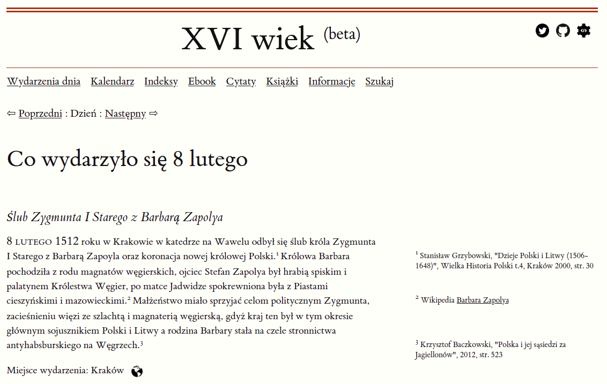

# xvi-wiek.pl
Źródła powstającego powoli serwisu z bazą danych wydarzeń historycznych z XVI wieku. Serwis w wersji beta
powinien być widoczny pod tym adresem: [xvi-wiek.pl](http://xvi-wiek.pl).

Serwis wykorzystuje styl [Tufte CSS](https://edwardtufte.github.io/tufte-css/) (licencja MIT ) z dodatkiem fontu [Crimson Pro](https://fonts.google.com/specimen/Crimson+Pro) (licencja Open Font License) Regular 400 i Regular 400 italic.

Backend serwisu obsługiwany jest przez program w języku Go, pliki yaml i mechanizm pamięci podręcznej typu klucz-wartość ([go-cache](https://github.com/patrickmn/go-cache), licencja MIT).
W roli routera wykorzystywany jest [chi](https://github.com/go-chi/chi). Walidacja danych - pakiet [validator](https://github.com/go-playground/validator). 

Ikona Github pochodzi ze strony [GitHub Logos and Usage](https://github.com/logos).

Ikona Twitter pochodzi ze strony [Twitter Brand Resources](https://about.twitter.com/en_us/company/brand-resources.html).  

Dodatkowy mechanizm to bot wysyłający raz dziennie na konto [@xvi-wiek](https://twitter.com/xvi_wiek) informację o ciekawym wydarzeniu historycznym, które zdarzyło się w XVI wieku właśnie w tym dniu. Kod źródłowy bota dostępny jest w osobnym repozytorium: [xvi-wiek-bot](https://github.com/pjaskulski/xvi-wiek-bot). 

Treść serwisu jest także dostępna w formie [ebooka](https://www.xvi-wiek.pl/pdf) (format pdf). Automatyczną konwersję z plików yaml do formatu LaTeX obsługuje program yaml2latex, którego kod źródłowy dostępny jest w osobnym repozytorium [xvi-wiek-yaml2latex](https://github.com/pjaskulski/xvi-wiek-yaml2latex).

Ten serwis zapewne nie powstałby, przynajmniej nie w takiej formie i nie w języku Go, gdyby nie lektura 
[książki](https://lets-go.alexedwards.net/) Alexa Edwardsa "Let's Go! Learn to Build Professional Web Applications With Golang".

## API

    GET /api/dzien/{month}/{day}
  
    Zwraca wydarzenia z określonego dnia np. /api/dzien/4/10 zwróci
    wydarzenia z 10 kwietnia.

    GET /api/today
  
    Zwraca dzisiejsze wydarzenia, zapytanie uruchomione 1 stycznia 2020
    zwróci wydarzenia z 1 stycznia.   

    Domyślnie zapytania zwracają wynik w formacie json, ale można także otrzymać 
    wynik w formacie xml ustawiając Content-Type na 'application/xml' w nagłówku 
    zapytania http.

Przykład odpowiedzi na zapytanie `curl https://xvi-wiek.pl/api/today`:

```json
[
   {
      "date":"07-01-1520",
      "title":"Król Zygmunt I Stary wydał przywilej toruński",
      "content":"7 stycznia 1520 roku król Zygmunt I Stary wydał przywilej toruński regulujący minimalny wymiar pańszczyzny (1 dzień w tygodniu od łana).  Rzeczywisty wymiar pańszczyzny często był już wówczas większy. Dodatkowo przywilej ten regulował prawo do wolnej żeglugi po Wiśle, ograniczając je tylko do szlachty, ograniczono także prawa miast do sprawowania sądów nad  szlachcicami, którzy popełnili przestępstwa na terenie miast. Moment wydania  przywileju przypada na okres przygotowań do wojny z zakonem krzyżackim,  król potrzebował zgody szlachty na zwiększenie podatków, w zamian szlachta oczekiwała i otrzymała przywileje, często kosztem innych stanów.",
      "location":"Toruń",
      "geo":"52.2476,21.0138",
      "people":"Zygmunt I Stary",
      "keywords":"przywilej",
      "sources":[
         {
            "value":"Wikipedia",
            "url":"https://pl.wikipedia.org/wiki/Przywilej_toru%C5%84ski_1520"
         },
         {
            "value":"Przegląd Historyczny, 1913",
            "url":"http://bazhum.muzhp.pl/media//files/Przeglad_Historyczny/Przeglad_Historyczny-r1913-t16-n2/Przeglad_Historyczny-r1913-t16-n2-s200-217/Przeglad_Historyczny-r1913-t16-n2-s200-217.pdf"
         }
      ]
   }
]
```

Przykład odpowiedzi na zapytanie `curl --header "Content-Type: application/xml" https://xvi-wiek.pl/api/today`:


```xml
<HistoricalEvent>
    <date>18-03-1584</date>
    <title>Zmarł Iwan IV Groźny</title>
    <content>18 marca 1584 roku w Moskwie podczas rozgrywania partii szachów zmarł  Iwan IV Groźny, wielki książę moskiewski, który jako pierwszy przybrał tytuł  cara. Prowadził agresywną politykę rozwoju terytorialnego swojego państwa, zaanektował Chanat Kazański i Chanat Astrachański, zaatakował zakon krzyżacki  w Inflantach, za panowania Zygmunta II Augusta i Stefana Batorego toczył liczne wojny z Litwą i Polską, zakończone w 1582 r. pokojem w Jamie Zapolskim.  Bezskutecznie starał się o rękę Anny Jagiellonki, a podczas elekcji 1573 r. -  o koronę Rzeczypospolitej.   </content>
    <location>Moskwa</location>
    <geo>55.7549,37.6227</geo>
    <people>Iwan IV Groźny</people>
    <keywords>Rosja</keywords>
    <sources>
        <value>Wikipedia</value>
        <url>https://pl.wikipedia.org/wiki/Iwan_IV_Gro%C5%BAny</url>
    </sources>
</HistoricalEvent>

```

## Zrzut ekranu



## TODO

- [ ] uzupełnić dane 
- [ ] refactoring 